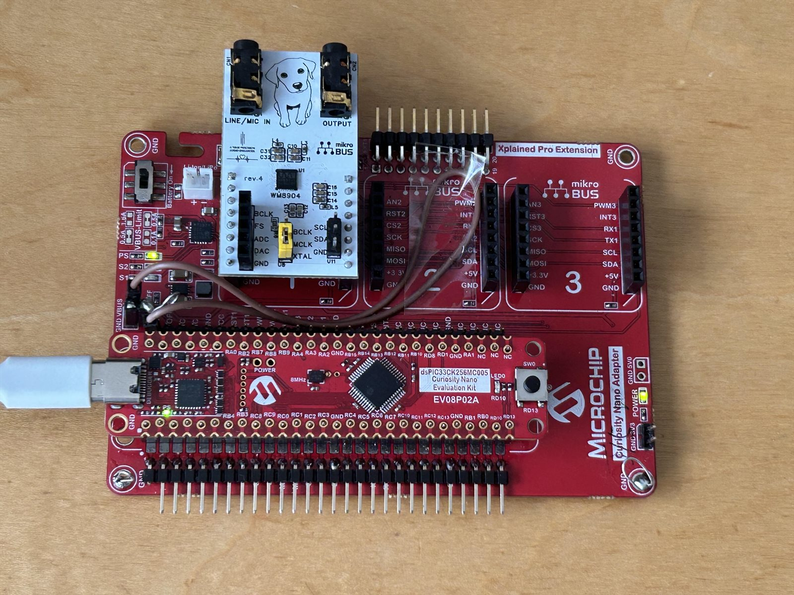

# dspic33ck-hal-lab

Bring-up lab for dsPIC33CK boards, and the place the CK NORA-HAL backends were
written and proven before being split out into their own repositories. The board
this tree is about is the **dsPIC33CK64MC105 EV88G73A Curiosity Nano** — it is
what runs, what every hardware result was taken on, and what a bare
`build.ps1` builds. The dsPIC33CK256MP508 Curiosity Development Board (DM330030)
is where the lab started and is still a buildable configuration, but no such
board is on the bench. The audio side is our own WM8904 mikroBUS codec board —
see [The codec board](#the-codec-board).

It is a lab, not a starter: it keeps a working audio application, host-side
analysis scripts and the diagnostic dead ends alongside the HAL, because the
findings are the point. It started from Microchip's small Curiosity demo, which
is still in the tree as the baseline escape hatch.

## Baseline

The primary target — the board on the bench:

- Board: **EV88G73A dsPIC33CK64MC105 Curiosity Nano**
- MCU: dsPIC33CK64MC105 (64 KB flash — the ROM budget is a real constraint here)
- MPLAB configuration: `CK64MC105_EV88G73A` (what a bare `build.ps1` builds)
- MPLAB project: `firmware.X`
- Source tree: `src`
- MPLAB X observed locally: v6.30
- XC-DSC observed locally: v3.31.01
- DFP: `Microchip dsPIC33CK-MC_DFP 1.10.386`
- Console: 230400 baud on the Nano's virtual COM port; audio built in by default

## Target profiles

| Configuration | Status | MCU / board |
| --- | --- | --- |
| `CK64MC105_EV88G73A` | **Primary, and the default build.** Hardware-verified: UART, I2C, TDM8/WM8904 audio, AVAS synth, traps | dsPIC33CK64MC105 / EV88G73A Curiosity Nano |
| `CK256MP508_DM330030` | Where the lab started; kept building as the roomy configuration (it catches what the 64 KB part hides), but **never run — no board here**. DFP `dsPIC33CK-MP_DFP 1.15.423` | dsPIC33CK256MP508 / DM330030 Curiosity |

### Bench setup

The primary hardware setup is the EV88G73A Curiosity Nano on a mikroBUS
extension board with the WM8904 codec board attached:



The MC105 profile has its own DFP, linker script and output directory, and
intentionally does not reuse DM330030 pin assignments. See
[`docs/ck_hal_ports_from_ak.md`](docs/ck_hal_ports_from_ak.md), "Build profiles".

Flashing the Nano is the routine path and is verified — `buildtools/flash-curiositynano.ps1`
copies the HEX to the board's drag-and-drop mass-storage interface and polls
`STATUS.TXT`. What is **not** verified is the on-board debugger *debug session*
(breakpoints, halt); `flashauto.ps1`'s PKOB4/ICSP path is a separate mechanism and
belongs to the DM330030 board, which has never been on hardware here.

## The codec board

The WM8904 in every audio path here is not a commercial module — it is an in-house
stereo codec add-on board in the **mikroBUS** form factor, and its EasyEDA design
files are published separately:
**[sulaolab/EasyEDA-WM8904-mikroBUS](https://github.com/sulaolab/EasyEDA-WM8904-mikroBUS)** (CC0-1.0).


The revision on the bench — the one all the hardware results in `docs/` were taken
with — is **rev.04**: built and verified, WM8904 at I2C address `0x1A`, on-board
crystal, and jumpers that select whether BCLK, MCLK or the crystal clocks the part.
Two things about it matter when reading this tree:

- rev.04 has **left and right reversed on both input and output**. The board works;
  the swap has to be undone in the host's WM8904 register setup. rev.05 fixes it in
  copper but has not been fabricated, so nothing here has run on rev.05.
- The clock-source jumpers are the reason `docs/ck_silicon_findings.md` keeps
  insisting on which side owns the master clock — a wrong jumper looks exactly like
  a firmware defect.

Pin-level facts for how the board lands on each host (the EV88G73A wiring, and
DM330030 mikroBUS A) stay in [`docs/ck_hal_ports_from_ak.md`](docs/ck_hal_ports_from_ak.md).

## Quick start

```powershell
# Prerequisites: MPLAB X v6.30, XC-DSC v3.31.01, dsPIC33CK-MC_DFP 1.10.386
#                (dsPIC33CK-MP_DFP 1.15.423 as well for the DM330030 profile)
git clone https://github.com/sulaolab/dspic33ck-hal-lab.git
cd dspic33ck-hal-lab

.\buildtools\build.ps1                                        # EV88G73A -- the default
.\buildtools\build.ps1 -Full                                  # regenerate makefiles, clean, build
.\buildtools\flash-curiositynano.ps1                          # flash the Nano
.\buildtools\build.ps1 -Full -Configuration CK256MP508_DM330030   # the other profile
```

MPLAB X is not required to build: `build.ps1` drives XC-DSC directly. Every switch,
the flash tooling and the host-side checks are in
[`buildtools/README.md`](buildtools/README.md) — **read it before flashing.**

## What it plays: the AVAS synth

The audio the lab makes is not a test tone — it is an **AVAS** (Acoustic Vehicle
Alerting System) sound, the kind of low-speed alerting sound an electric vehicle
emits, synthesised on the CK in real time. Two voices are implemented, `type_ty` L1
and `type_lb` L3; they model AVAS sounds of the kind already in public use on the
road, and the line and noise data are the project's own.

It is an additive **line model** — `type_ty` L1 is 185 spectral lines in 11 clusters,
`type_lb` L3 is 264 lines in 4 — run entirely in **fixed point**, because CK has no
FPU and half AK's cycles per sample. That is the whole point of the port: the float
engine it came from needs 93 % of the budget before the first soft-float call, while
this one measures **289.2 µs of a 667 µs block (43.0 %), miss = 0**. The derivation is
in [`docs/ck_silicon_findings.md`](docs/ck_silicon_findings.md) and
`src/app/dsp/avas_synth_line_ck.h`.

The EV88G73A profile builds the audio application by default, so a flashed board is
already at the console at **230400 baud** with the codec streaming TDM8/32-bit.

### Sounding it

Single keys take effect immediately — **no Enter**:

| key | effect |
| --- | --- |
| `a` | start/stop the `type_ty` L1 voice. A start from silence begins at t = 0 of the reference and opens over 4 s; a stop **fades out over ~3 s** rather than cutting, and pressing it again during the fade resumes without a phase reset |
| `A` | the same for the `type_lb` L3 voice |

The two voices are **run-time exclusive**: pressing the letter of the voice that is
sounding stops it, and pressing the other one's letter refuses and says why — a
switch re-seeds every oscillator, which mid-sound is a click. The primary
`CK64MC105_EV88G73A` ROMイメージ contains both voices, so both `a` and `A` are
normal supported commands; no alternate build is needed to use them.

The only structured AVAS command is Sonora Classic-compatible `*cy00`, which
toggles the `type_ty` voice. `*cy01` stays reserved for Sonora's pinger and is
therefore unsupported on CK; `type_lb` remains deliberately key-only (`A`).
There is no CK-only scripted select/start interface.

The earlier CK-only forms `*ta0000`, `*ta0001`, `?ta`, `*tv0000`, `*tv0001`,
and `?tv` are deliberately retired. They have no handler in the primary image and
return `command not found` (`$01`); replace them with `a` / `*cy00` for Type_TY
and `A` for Type_LB. They are not manual commands.

The following are the remaining audio commands supported by the primary
`CK64MC105_EV88G73A` ROMイメージ:

| command | effect |
| --- | --- |
| `*tp` / `?tp` | advance / report the block path (`copy`, `mute`, `tone`, `gain`) |
| `*ti<NNNN>` / `*to<NNNN>` | PRE / POST gain, tenths of a dB, signed: `*ti003C` = +6.0 dB, `*tiFFF6` = −1.0 dB |
| `*tq` / `*tq0000` / `*tq0001` / `?tq` | stop / start / report the fixed-period TDM1 load line; `*tq0002YYYY` is explicitly unsupported |
| `*td[NN]` / `?td` | one-shot declick restart and its strategy report; bare `*td` means `00` |
| `*ts` | analog-mute the codec and halt TDM/DMA. **Do this before flashing** |
| `*tr` / `?ts` | restart the stream / report its state after a stop |

Optional TDM diagnostic forms `*tb` / `?tb`, `*tl`, and `*tm` are intentionally
left out of this dual-voice primary image to fit the 64 KB part. Do not put them
in a manual or an operational script for this image: they return `command not
found` rather than silently doing something else.

The primary image keeps `x` reserved for the exception module, but deliberately
does not include the destructive `*xa` / `*xm` / `*xs` trap-test commands. The full
letter map is at the top of [`src/uart_app/console_dispatch.c`](src/uart_app/console_dispatch.c).

### Mute/unmute from the board button

**`SW0` on the Curiosity Nano mutes and unmutes the output** — no console needed.
It is sampled every 100 ms, edge-detected in the application, and prints one line
per press. The mute is not a hard cut: it ramps the Q31 gain in the block ISR, and
this profile deliberately asks for a **long 800 ms ramp** (snapped to the nearest
curve in the table, 791 ms at 48 kHz; the boot banner prints both numbers) so the
fade is obvious to a listener rather than merely click-free. 300 ms is the setting to
return to if transparency is wanted instead.

The button has one job per image by construction: in a non-audio build the same
`SW0` pauses the LED0 blink instead, and the two uses cannot both be compiled in.

## The three documents

`docs/` was 18 per-milestone files; consolidated 2026-08-03 to three, by subject:

| file | holds |
| --- | --- |
| [`docs/ck_silicon_findings.md`](docs/ck_silicon_findings.md) | what **hardware** settled: the SPI/DMA defect audit, the two clock defects, traps, ISR cost and optimization levels, and the diagnostic traps that each cost a session. **Read this before trusting a register value anywhere.** |
| [`docs/ck_hal_ports_from_ak.md`](docs/ck_hal_ports_from_ak.md) | the AK→CK **register deltas** per HAL (clock, DMA, I2C, PPS, GPIO event, SPI/I2S/TDM + the CLC frame-sync remap), and the build profiles |
| [`docs/ck_src_layout.md`](docs/ck_src_layout.md) | the **tree as it is now** — why the chip/board split falls where it does, and the reorganisation record |

## Bring-up direction, as it was set out

The plan below is kept as written; steps 1-6 are done, and what each one cost is
in the three documents above.

1. Keep the copied demo building as the baseline escape hatch.
2. Reduce `main.c` to clock, UART, timer tick, and heartbeat.
3. Add CK board pin facts for DM330030, especially mikroBUS A.
4. Port the AK I2C HAL API shape, but rewrite the CK register layer.
5. Probe WM8904 on mikroBUS A: I2C1 alternate pins, address `0x1A`, register `0x00`, expected ID `0x8904`.
6. Port timer, UART, SPI, and SPI framed-mode I2S/TDM in the same staged style.

## Notes

- EV88G73A hardware is verified well past smoke-test depth (TDM8 streaming, traps, I2C
  mechanism); DM330030 has never been on hardware — no board.
- `firmware.X` is kept for MPLAB X project files; source files live under `src`.
- The CK HAL backends this lab produced are published separately, one repository per
  peripheral; this tree is where they are exercised against real hardware:
  [clock](https://github.com/sulaolab/nora-hal-dspic33ck-clock) ·
  [dma](https://github.com/sulaolab/nora-hal-dspic33ck-dma) ·
  [gpio](https://github.com/sulaolab/nora-hal-dspic33ck-gpio) ·
  [i2c](https://github.com/sulaolab/nora-hal-dspic33ck-i2c) ·
  [spi-i2s-tdm](https://github.com/sulaolab/nora-hal-dspic33ck-spi-i2s-tdm) ·
  [timer](https://github.com/sulaolab/nora-hal-dspic33ck-timer) ·
  [uart](https://github.com/sulaolab/nora-hal-dspic33ck-uart)
- `buildtools/build.ps1` can build the copied MPLAB X demo directly with XC-DSC, without generated MPLAB makefiles.
- `src/hal_gpio` starts the CK HAL foundation with an AK-shaped GPIO/PPS API. The names now sit in the shared NORA namespace (`nora_gpio*`, `nora_pps*`, with the silicon side tagged `_dspic33ck`); what stays CK-specific is the RP mapping, not the prefix — CK numbers RPn with the classic flat map `16*(port+1) + bit`, not AK's packed-pin+1 encoding.
- `src/hal_timer` adds the AK-shaped CK Timer1 1 ms tick HAL; the existing demo timer still owns the interrupt vector until the next replacement step.
- The SPI framed-mode TDM feasibility facts (frame geometry, `FRMCNT` in wire words, clock math, the `slots_per_fs ≤ 16` bound) are in `docs/ck_silicon_findings.md`, Part 7; the probe's register assertions live on in `hal_spi_i2s_tdm/nora_spi_i2s_tdm_dspic33ck_reg_assert.h`.
- The project configuration was taken from Microchip's `dspic33ck_curiosity_demo_v2020_12_08` MPLAB X demo, retargeted at the currently installed XC-DSC/DFP versions. That demo folder is not committed here, and neither are generated MPLAB makefiles or build outputs.

## Licensing

The project's own code is MIT-0 — see [`LICENSE`](LICENSE).

Six files descend from Microchip's Curiosity demo and remain under **Apache
License 2.0**. They keep Microchip's copyright and licence header, and the full
licence text is included at
[`LICENSES/Apache-2.0.txt`](LICENSES/Apache-2.0.txt). Per Apache-2.0 §4(b), each
file that was changed says so in its header, and this is what changed:

| file | state |
| --- | --- |
| [`src/app/timer_1ms.c`](src/app/timer_1ms.c) | **modified** — clock frequencies taken from the Clock HAL instead of hardcoded; the tick moved onto the CK timer HAL |
| [`src/app/timer_1ms.h`](src/app/timer_1ms.h) | **unmodified** — relocated only (was `firmware.X/bsp/`) |
| [`src/boards/dm330030/main.c`](src/boards/dm330030/main.c) | **modified** — reduced to this board's profile hooks; ~380 lines of application code moved out |
| [`src/boards/dm330030/dm330030_led3_rgb.c`](src/boards/dm330030/dm330030_led3_rgb.c) | **modified** — pin writes moved onto the GPIO HAL, per-pin ANSEL ownership, configuration-ownership assert |
| [`src/boards/dm330030/dm330030_led3_rgb.h`](src/boards/dm330030/dm330030_led3_rgb.h) | **modified** — renamed into the board namespace, pin macros restated |
| [`src/boards/dm330030/demo_rgb_pot_buttons.c`](src/boards/dm330030/demo_rgb_pot_buttons.c) | **modified** — split out of `main.c`; button debounce extracted, console hooks added |
